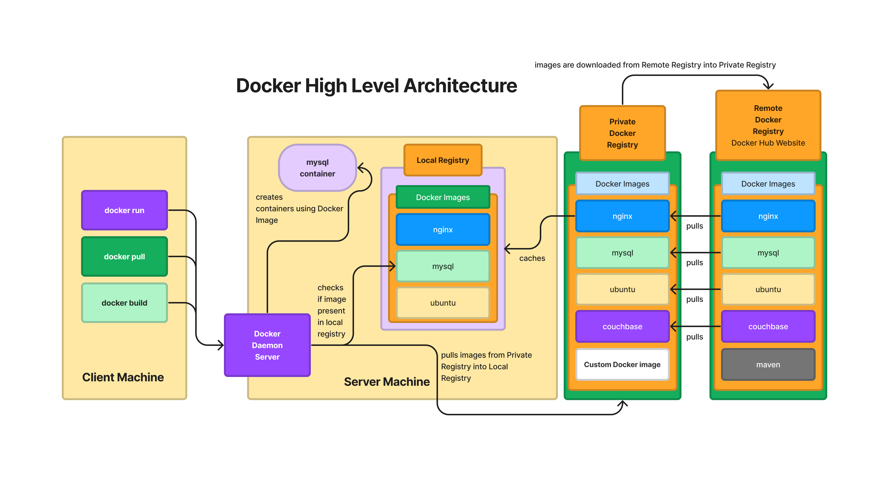

# Day 2 - Docker

## Processor Packaging
- Two of types of Packing
  SCM
  - Single Chip Module
  - a single IC can host only one Processor
  MCM
  - Multiple Chip Module
  - a single IC can host multiple Processors
  - in a single CPU Socket, if we install a Processor (MCM) - this means 1 CPU Socket could support multiple Processors
 
## Server Grade Motherboads
- they support Multi-socket 

## Processor with multiple CPU Cores
- maximum CPU cores you have seen in a server grade processor
- 256 cpu cores per processor

## What is Hypervisor ?
- Virtualization Technology
- helps us run multiple Operating System on the same laptop/desktop/workstation/server
- mutiple OS can be active at the same time on the same machine
- this is a Hardware + Software technology
- We need Processor that supports Virtualization
- AMD processor
  - Virtualization feature supported by AMD Processor is AMD-V
- Intel processor
  - Virtualization feature supported by Intel Processor is VT-X
- There are two of hypervisors softwares
  - Type 1 
  - Type 2
- Type 1 Hypervisor
  - used in servers/workstations
  - this doesn't require an Operating System to be installed to create Virtual Machines
  - this is also called as Bare Metal Hypervisor
  - Examples
    - VMWare vSphere/vCenter
- Type 2 Hypervisor
  - used in laptops/desktops/workstations
  - this requires an OS to install the Hypervisor
  - Examples
    - VMWare
      - Fusion ( Mac OS-X ) - requires license
      - Workstation ( Windows & Linux ) - requires license
    - Microsoft Hyper-V ( Windows ) - comes with server grade windows
    - Oracle VirtualBox ( Linux, Windows & Mac ) - Free  
    - KVM ( Linux ) - opensource & Free
- this type of virtualization is considered heavy weight as each OS that we install in a Virtual Machine requires dedicated hardware resources
  - we need to allocate CPU Cores to each VM
  - we need to allocate RAM to each VM
  - we need to allocate Storage to each VM
  - Virtual machine also gets virtual network card and virtual graphics cards, etc.,
- each Virtual Machine represents one fully functional Operating System, these OS that runs inside the Virtual Machine is referred as Guest OS
- In case of Type 2 Virtualization software, the OS on which the virtualization software is installed is referred as Host OS

Advantages
- to host 1000 OS as VMs, how many minimal physical servers are required
- Technically, 1 Physical server can host 1000+ Virtual machines
- 
## How many physical servers are required to support 1000 OS without using Virtualization software/technology?
- 1000 Physical servers
- We need a data-center(server room) that can occupy 1000 server
  - Real estate cost involved ( rent/lease )
  - Servers tend to create lot of noise ( sound proofing cost involved )
  - Servers tend to create lot of heat ( Air Conditioning that runs 24x7 - cost involved )
  - Servers are power hungry, they will consume lot of electricity
  - Electricity Bill
- Assume that the server motherboard has 4 CPU Sockets
- If we install MCM based Processor, i.e each IC supporting let's say 4 processors
- 16 Processors and each Processor supporting 256 CPU Cores
- total cores = 16 x 256 = 4096 Physical Cores
- total virtual cores = 4096 x 2 = 8192 virtual cores
- Virtual machines use virtual cores
  - Hyperthreading - each physical cpu core supports 2 to 4 virtual cores
## Hypervisor vs Docker

## High Level Architecture of Hypervisor

## Linux Kernel Features that enable Container Technology
- Namespace
  - this helps in isolating one container from other containers
- Control Groups (CGroups)
  - this helps in applying some resource quota restrications for containers

## Docker Overview
- light-weight application virtualization technology
- each container represents one running application
- containers don't run OS
- containers dont' get their own dedicated hardware resources
- containers don't have their own OS Kernel
- containers are just application process that runs in separate namespace
- containers will never be able to replace Operating System or Virtual Machines
- containers are not competing technology to Virtualization, they are complementing technology. Meaning, they can used in combination.

- each container represents one application
- each container runs in a separate namespace
- each container has its own virtual network stack
- hence, every containers gets one or more IP Addresses
- containers has its own file system
- containers are created using Container Images
- Container Images comes with pre-loaded/pre-installed applications
- Whaever software are there in the Container Image, are available in a ready to use fashion on the containers
  
## High Level Architecture of Docker


## What is Container Engine?
- high-level software which is also end-user friendly
- Container Engines depends on container Runtime softwares to manage containers
- as this is user-friendly, end-users like us tend to use this software instead of Container Runtime
- Example:
  - Docker is a Container Engine which internally depends on Containerd that in turn depends on runC Container Runtime
  - Podman is a Container Engine which internally depends on CRI-O Container Runtime
    

## What is a Container Runtime?
- is a low-level software that knows how to manage containers
- manage containers
  - create containers in background/foreground
  - list containers
  - delete containers
  - start/stop/restart/kill/abort containers
- it is not so user-friendly software, hence normally no end-users use this software directly
- Examples
  - runC
  - CRI-O
  - rkt
  - LXC

## Docker Alternatives
- Podman
- Containerd

## Installing Docker in Windows
https://docs.docker.com/desktop/install/windows-install/

## Installing Docker in Ubuntu
https://docs.docker.com/engine/install/ubuntu/

## Installing Docker in CentOS
https://docs.docker.com/engine/install/centos/

## Installing Docker in Mac
https://docs.docker.com/desktop/install/mac-install/

## What is Docker Image?
- Docker Image is similar to window iso DVD image we download from Microsoft website
- We can burn a DVD with windows iso, with that Windows Image DVD we can install Windows on any number of Laptops/PC
- Docker Image is similar to ISO images
- Docker Images container some pre-installed softwares
- With Docker Image we can create as many containers as we need
- a blueprint of a Container

## What is Docker Container?
- Container is a running instance of a Docker Image
- When we create a container using a particular Docker Image, that containers gets an unique name and hostname
- The container will be in any one of following state
  - created
  - running
  - exited
- The container gets an Private IP address
- The container will have all the softwares installed on the Docker Image
# Docker Commands

## Lab - Finding the docker version
```
docker --version
docker info
```

Expected ouput


The default location of Docker Local Registry is /var/lib/docker

## Lab - Listing docker images in your docker local registry
```
docker images
```

Expected output


## Lab - Deleting a Docker Image from your local docker registry
```
docker rmi hello-world:latest
```

Expected output


## Lab - Downloading docker image from Docker Remote Registry to Docker Local Registry
```
docker images
docker pull hello-world:latest
docker images
```

Expected output


## Lab - Creating a container in background
```
docker run -dit --name ubuntu1 --hostname ubuntu1 ubuntu:16.04 /bin/bash
```
The above command will create a new container and start running the container

Things to note
<pre>
d - stands for deattached/daemon i.e runs the container in the background
it- interactive terminal
name - ubuntu1 is the name of the container we have assigned
hostname - ubuntu1 is the hostname we have assigned for the container
ubuntu:16.04 - is the docker image we downloaded from Docker Hub Remote Registry
16.04 - is the tag/version of ubuntu we downloaded from Docker Hub Remote Registry
/bin/bash - is the shell we launched inside the container
</pre>

Each time we execute the docker run command, it would create a new container and starts that, hence we must provide a unique container name and hostname.

As long as the bash shell contintues to run inside the container, the container will be running.  If we exit the bash shell inside the container then it will exit container as well, leading to stopping the container.

Let us list the docker images to check if the above command has download the ubuntu:16.04 image from Docker Hub - Remote Registry to Local Docker Registry
```
docker images
```

Expected output


Finding if the ubuntu1 container that we created is running
```
docker ps
```

Expected output


## Lab - Stopping a running container
```
docker ps
docker stop ubuntu1
docker ps
docker ps -a
```

Expected output


## Lab - Start an exited container
```
docker ps -a
docker start ubuntu1
docker ps
```

Expected output


## Lab - Restarting a running container
```
docker ps
docker restart ubuntu1
docker ps
```

Expected output

